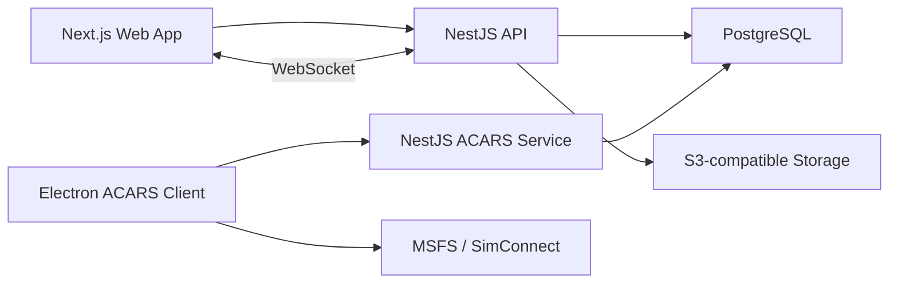

# Architecture MVP

## Objectif

Construire une plateforme de compagnie aerienne virtuelle exploitable en production legere, avec un MVP solide, maintenable et extensible, sans partir dans une architecture disproportionnee pour le besoin initial.

## Principes directeurs

- MVP d'abord, sophistication ensuite.
- Une seule source de verite pour les donnees: PostgreSQL.
- Une seule facon de faire par responsabilite critique.
- Une frontiere tres claire entre metier VA et execution ACARS.
- Pas d'abstraction preventive hors besoins vraiment transverses.

## Vue d'ensemble

Le systeme est organise autour de quatre applications:

- `apps/web` pour le site public, l'espace pilote et l'admin.
- `apps/api` pour le metier VA, l'auth, les referentiels, les bookings et la facade web.
- `apps/acars-service` pour l'execution ACARS, la telemetrie et le PIREP automatique.
- `apps/acars-desktop` pour le client desktop relie a MSFS via une abstraction SimConnect.

Le choix retenu n'est ni un monolithe unique, ni une architecture microservices complete. C'est une separation pragmatique en deux backends:

- un backend web/metier,
- un backend technique/temps reel ACARS.

## Pourquoi un monorepo TypeScript

Le monorepo simplifie:

- le partage de contrats et enums entre web, API et client desktop,
- la coherence des conventions TypeScript,
- la maintenance des scripts dev/build/test,
- l'evolution par etapes sans dispersion excessive.

Le couple `pnpm` + `turbo` est retenu parce qu'il reste leger, rapide et peu intrusif.

## Frontiere `apps/api` vs `apps/acars-service`

La frontiere entre ces deux services doit etre explicite pour eviter les doubles ecritures et les responsabilites floues.

### Regle de base

- `apps/api` possede le metier VA "catalogue, administration, consultation et workflows web".
- `apps/acars-service` possede le metier ACARS "execution de vol, telemetrie, interpretation, scoring".

### `apps/api` possede

- authentification JWT access/refresh,
- roles et permissions,
- profils pilotes,
- liaison SimBrief minimale au niveau du profil pilote,
- grades,
- hubs,
- aeroports,
- types d'avion,
- flotte,
- routes et schedules,
- reservations de vols,
- qualifications, exams, checkrides,
- contenu public, actualites, reglages,
- notes staff,
- validation ou rejet final des PIREPs,
- facade WebSocket pour le frontend web.

### `apps/acars-service` possede

- recuperation des reservations eligibles pour le client ACARS,
- validation du demarrage d'un vol a partir d'un booking,
- creation technique du `flight` operationnel,
- creation et reprise de l'unique `acars_session` canonique du `flight` pour le MVP,
- reception de telemetrie,
- detection des phases de vol,
- moteur d'evenements,
- violations et anti-cheat basique,
- calcul du score,
- generation automatique du `pirep`.

### `apps/api` ne doit pas faire

- ingerer la telemetrie brute,
- recalculer les phases de vol,
- ecrire dans `telemetry_points`,
- ecrire dans `flight_events`,
- refaire la logique anti-cheat,
- parler directement a SimConnect.

### `apps/acars-service` ne doit pas faire

- gerer le CRUD admin des hubs, aeroports, flotte ou contenu public,
- devenir l'API principale du dashboard web,
- exposer directement la surface publique du site,
- porter la gouvernance globale des roles et permissions staff/admin.

### Contrat entre les deux services

Le contrat retenu est volontairement etroit:

1. `apps/api` cree et gere les `bookings`.
2. `apps/acars-service` lit les `bookings` eligibles.
3. Au demarrage du vol, `apps/acars-service` cree le `flight` et la `acars_session`.
4. `apps/acars-service` met a jour les tables techniques et le resume courant.
5. `apps/api` lit cet etat pour le dashboard, l'historique et la carte live.
6. Le frontend web ne parle qu'a `apps/api`, pas directement au backend ACARS.

### Regle canonique booking -> flight

La regle metier a respecter est la suivante:

- un `booking` ne peut produire qu'un seul `flight`,
- ce `flight` est l'unique execution canonique du `booking`,
- en cas d'abandon ou de statut `ABORTED`, on ne recree pas un second `flight` sur le meme `booking`,
- si un nouveau depart est autorise apres abort, il doit passer par une nouvelle reservation ou par une regle metier future explicitement documentee.

## Topologie logique

## Applications du monorepo

### `apps/web`

Responsabilites:

- pages publiques,
- auth web,
- dashboard pilote,
- panel admin,
- carte live,
- documentation ACARS,
- contenu CMS.

Pourquoi un seul frontend:

- partage maximal des layouts et composants,
- deploiement plus simple,
- experience coherente entre public, pilote et admin.

### `apps/api`

Responsabilites:

- authentification et autorisation,
- modules VA CRUD,
- gestion des bookings,
- moderation des PIREPs,
- endpoints publics,
- facade live pour le web.

### `apps/acars-service`

Responsabilites:

- session ACARS canonique du vol,
- telemetrie,
- phases,
- evenements,
- violations,
- PIREP automatique,
- reprise de session.

### `apps/acars-desktop`

Responsabilites:

- login pilote,
- etat backend / simulateur,
- recuperation des bookings,
- lancement d'un vol,
- affichage des phases et du log,
- soumission finale du commentaire pilote.

## Packages du monorepo

### `packages/database`

- schema Prisma,
- migrations,
- seeds,
- client Prisma partage.

### `packages/shared`

Ce package doit rester strictement limite a:

- enums de domaine reellement communs,
- types de payload communs,
- contrats reseau utilises par plusieurs applications.

Ce package ne doit pas contenir:

- logique metier,
- services,
- acces base de donnees,
- validateurs propres a une seule app,
- DTO internes a `apps/api`,
- helpers UI.

### `packages/sdk`

- client TypeScript pour parler a l'API depuis le web ou Electron,
- optionnel mais utile pour centraliser les appels reseau.

### `packages/ui`

Ce package est volontairement minimal:

- pas de design system complet au MVP,
- pas de librairie de composants generique par principe,
- seulement un espace reserve au cas ou un petit utilitaire ou un composant devient clairement repetitif.

Si le besoin de partage visuel n'est pas prouve, `packages/ui` doit rester quasi vide.

### `packages/config`

- configuration TypeScript stricte,
- presets de conventions,
- outillage partage.

## Flux clefs du MVP

### Reservation puis vol

1. Le pilote reserve un vol via `apps/web`.
2. `apps/api` cree le `booking`.
3. `apps/acars-service` expose les bookings eligibles au client ACARS.
4. Le client ACARS lance le vol.
5. `apps/acars-service` verifie la coherence et cree l'unique `flight` canonique du booking, puis son `acars_session`.

### Telemetrie puis live tracking

1. Le client Electron lit la telemetrie via `SimulatorBridge`.
2. Il pousse des snapshots a `apps/acars-service`.
3. `apps/acars-service` persiste les points utiles et met a jour l'etat courant.
4. `apps/api` lit cet etat et l'expose via WebSocket au frontend web.

### Fin de vol puis PIREP

1. `apps/acars-service` detecte l'arrivee parking et la fin de vol.
2. Il calcule score et violations.
3. Il genere le `pirep` automatique.
4. Le pilote ajoute son commentaire.
5. `apps/api` permet au staff de valider ou rejeter le PIREP.

## Regles structurelles du modele d'execution

### Identite pilote en ACARS

Pour le MVP, `AcarsSession` ne porte pas `userId`.

Le choix retenu est:

- l'identite pilote canonique pendant l'execution vient de `flight -> pilotProfile`,
- on evite ainsi une ambiguite entre `User` et `PilotProfile` dans le coeur ACARS,
- si un acces direct pilote devient necessaire plus tard, on ajoutera un champ denormalise `pilotProfileId`, pas un second rattachement ambigu.

### Sessions ACARS par vol

Pour le MVP executable strict:

- un `flight` possede au plus une `acars_session`,
- les coupures reseau et reconnexions reutilisent la meme ligne via `resumeToken` et `connectCount`,
- les sessions multiples pour un meme `flight` sont hors perimetre du MVP immediat.

### Session canonique pour le PIREP

La regle retenue est:

- le `pirep` reste attache a `flight`,
- si le vol a une session ACARS, cette session unique est la session canonique pour generer et finaliser le PIREP automatique,
- `Pirep.sessionId` peut rester nul pour un cas manuel ou exceptionnel sans session ACARS exploitable.

### Vocabulaire ferme des `flight_events`

Le type des evenements n'est plus libre. Le vocabulaire MVP est ferme:

- `BOOKING_VALIDATED`
- `SESSION_STARTED`
- `SESSION_RESUMED`
- `SESSION_DISCONNECTED`
- `PHASE_CHANGED`
- `VIOLATION_RECORDED`
- `PIREP_GENERATED`
- `FLIGHT_COMPLETED`
- `FLIGHT_ABORTED`

Les details complementaires restent portes par `phase`, `code`, `message` et `payload`.

## Decisions techniques importantes

### PostgreSQL comme source de verite unique

Le MVP ne justifie pas une base specialisee par besoin. PostgreSQL centralise:

- donnees VA,
- reservations,
- vols,
- sessions ACARS,
- violations,
- PIREPs,
- reglages.

### WebSocket cote API, pas cote frontend direct sur ACARS

Le frontend web ne doit pas consommer directement les flux ACARS:

- l'auth reste centralisee,
- la surface exposee au web reste stable,
- la logique technique ACARS reste interne.

### Pas de broker obligatoire au MVP

Le besoin temps reel est reel, mais un broker n'est pas impose des le depart. La premiere version s'appuie sur:

- ecriture des etats courants en base,
- lecture par l'API,
- diffusion WebSocket depuis l'API.

Une evolution future reste possible vers:

- projection `live_flights`,
- event bus interne,
- cache distribue.

### Phase detection et scoring simples d'abord

Le moteur ACARS doit rester lisible:

- machine a etats simple,
- seuils configurables,
- violations explicites,
- score final comprehensible.

## Mocks et abstractions obligatoires

Le MVP doit rester developpable sans dependre de tous les systemes reels.

Abstractions attendues:

- `SimulatorBridge` avec implementation reelle et mock,
- `FileStorageService` avec implementation S3-compatible et mock/local,
- ingestion de telemetrie testable sans vrai simulateur.

Pour SimBrief dans le sprint courant:

- seul le `SimBrief Pilot ID` est stocke au niveau du `pilot_profile`,
- la recuperation du dernier OFP reste isolee dans un endpoint backend dedie,
- l'appel externe passe par `xml.fetcher.php?userid=...&json=v2`,
- le backend normalise les etats `NOT_CONFIGURED`, `NOT_FOUND`, `ERROR` et `AVAILABLE`,
- aucun OFP n'est persiste en base dans ce sprint,
- le web consomme ce resume en SSR sans modifier le desktop ACARS,
- le rapprochement OFP <-> bookings/vols est calcule cote web a partir de la route, du callsign/numero de vol, puis de l'appareil comme signal secondaire.

## Perimetre MVP executable strict

### Modules a implementer maintenant

- `auth`, `roles`, `users`, `pilot_profiles`
- `ranks`
- `hubs`, `airports`
- `aircraft_types`, `aircraft`
- `routes`, `schedules`
- `bookings`
- `flights`
- `acars_sessions`
- `telemetry_points`
- `flight_events`
- `violations`
- `pireps`
- facade live WebSocket
- `news_posts` si l'on veut une actualite geree en base des la premiere livraison

### Modules reportes apres MVP immediat

- `qualifications`
- `exams`
- `checkrides`
- `staff_notes`
- `content_pages`
- gestion de contenu public administree complete
- stockage fichiers reel S3 si aucun besoin concret n'apparait dans la premiere livraison
- tout moteur de regles avance au-dela du scoring simple et des violations de base

## Hors perimetre MVP

- economie ou monde persistant,
- dispatch complexe,
- gameplay type MetaFlight,
- analytics avancees,
- anti-cheat pousse,
- prise en charge multi-simulateurs complete.
